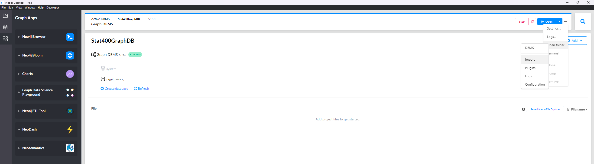

## building your local GraphDB for crude TextBook Index
> This is not the Graph DB that we want to achieve. Just here for presenting the use of GraphDB for knowledge presentation in a crude hiearchical manner.

Install Neo4j Desktop, create a new graphDB, 
and put the csv at `data/concepts_regex_blocks.csv` into the import folder of your graphDB.
import folder can be accessed here: 

Then open neo4j browser: 

Run the cypher script in `graphDB/cypher_script.md`

To show all the nodes:
```cypher
MATCH (n) RETURN n;
```


## Prompt for turning markdown code into cypher script.
You are tasked with converting a markdown version of node (we will call it node A) into a cypher script that add the node into Neo4j.

Beside the markdown content, you will also be given a list of 'node name':'node type' pairs, each pair represent a node and its type in Neo4j. When modeling relations in the markdown, the cypher script should detect whether the node (we will call it node B) at the other side of the relation exist in the list, and if it does, the script should add the relation to that Node B, otherwise the script should create a new node with the name and type of specified node B.

<Markdown Node>

</Markdown Node>

<Neo4j Node List>

</Neo4j Node List>

