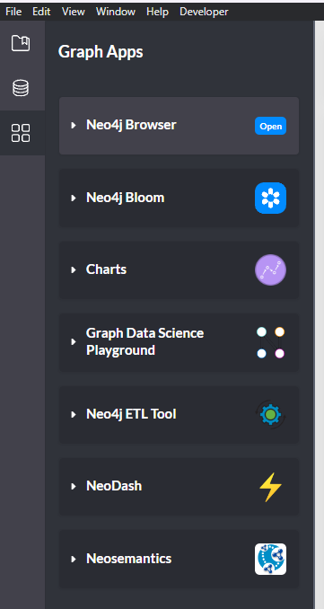

Install Neo4j Desktop, create a new graphDB, 
and put the csv at `data/concepts_regex_blocks.csv` into the import folder of your graphDB.
import folder can be accessed here: 

Then open neo4j browser: 

Run the cypher script in `graphDB/cypher_script.md`

To show all the nodes:
```cypher
MATCH (n) RETURN n;
```
